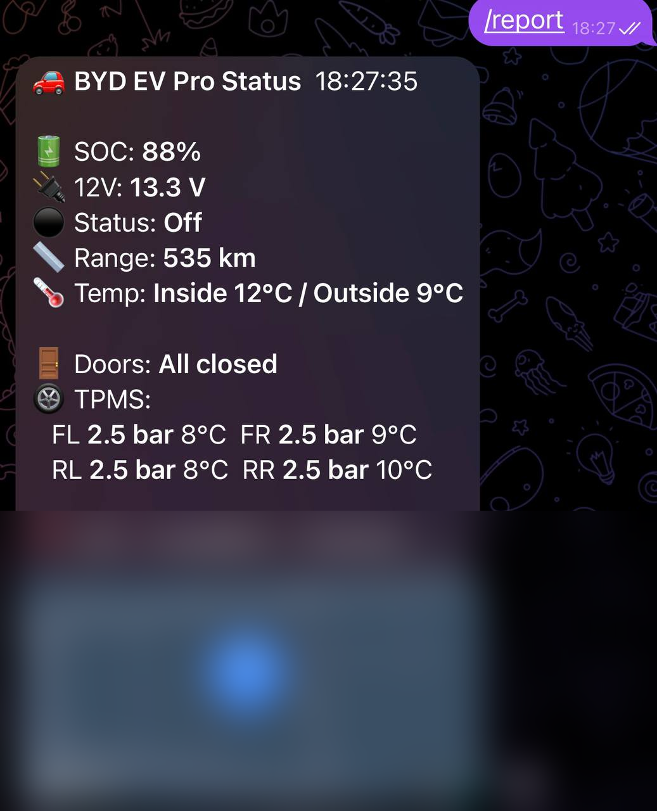
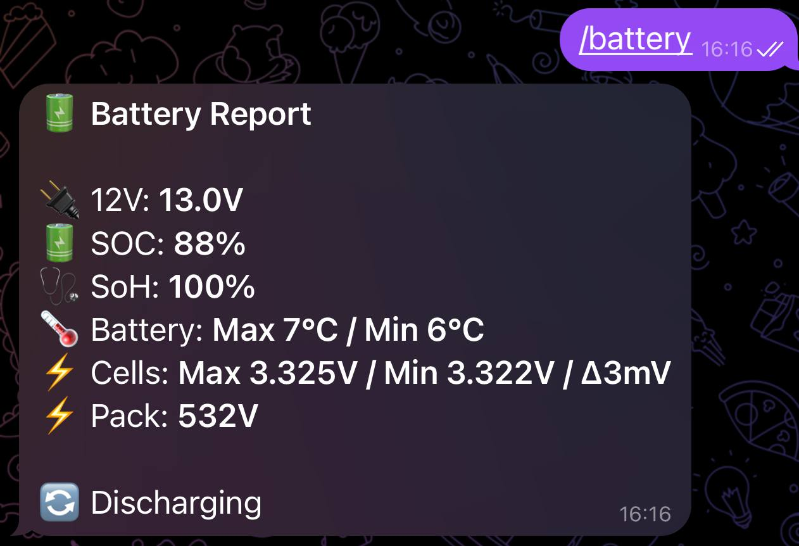
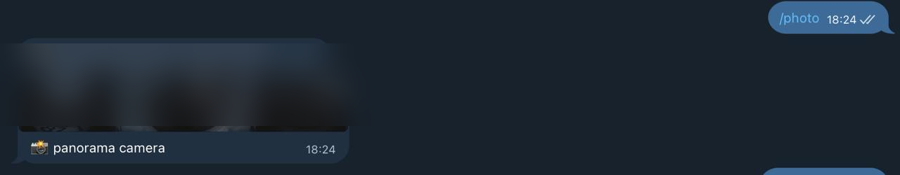
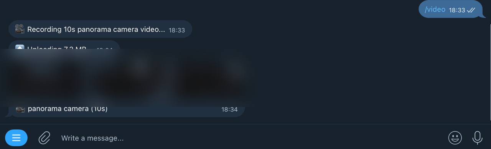

# Telegram-бот

BYD EV Pro може підключатися до Telegram-бота, який дозволяє перевіряти стан автомобіля, переглядати деталі батареї, робити фото та відео з камер та завантажувати діагностичні журнали — все це з вашого телефону через Telegram.

> [!NOTE]
> Інтеграція з Telegram доступна лише у **розширеній версії** (потрібна активна підписка або пробний період).

---

## Команди бота

| Команда | Опис |
|---|---|
| `/start` | Запуск бота та привітальне повідомлення |
| `/register` | Прив'язка бота до вашого автомобіля за допомогою Installation ID |
| `/unregister` | Відв'язати ваш Telegram-акаунт від автомобіля |
| `/report` | Отримати поточний звіт про стан автомобіля (SOC, запас ходу, температури, двері, TPMS, GPS з картою) |
| `/battery` | Переглянути деталі батареї: напруга комірок, SoH, напруга пака, стан зарядки |
| `/photo` | Зробити фото з камери автомобіля (панорамна, фронтальна або cam0) |
| `/video` | Записати 10-секундне відео з камери автомобіля |
| `/send_logs` | Завантажити діагностичні журнали розробнику |

---

## Скріншоти

### `/report` — Звіт про стан автомобіля

Повний звіт із SOC, 12V батареєю, станом авто, запасом ходу, температурами, станом дверей, тиском TPMS та GPS-розташуванням з картою.

### `/battery` — Звіт по батареї

Деталі батареї: напруга 12V, SOC, SoH, діапазон температур батареї, мін/макс напруга комірок з дельтою та напруга пака.

### `/photo` — Фото з камери

Знімок з панорамної камери автомобіля, надісланий безпосередньо в чат.

### `/video` — Відеозапис

Запис 10-секундного відео з панорамної камери, завантаження та надсилання як відеоповідомлення.

---

## Налаштування

1. Відкрийте застосунок і перейдіть до **Налаштування > Telegram-бот**.
2. Натисніть **Підключити**, щоб зв'язати застосунок з Telegram-релеєм.
3. Відкрийте Telegram на телефоні та розпочніть розмову з ботом.
4. Надішліть `/register` та дотримуйтесь інструкцій для прив'язки автомобіля.

Після реєстрації ви можете надсилати будь-яку з наведених вище команд для отримання інформації з автомобіля.

---

## Сповіщення

Екран налаштування Telegram дозволяє перемикати сповіщення для різних подій:

- **Головний перемикач** — увімкнути або вимкнути всі Telegram-сповіщення
- **Вміст звітів** — обрати, які поля включати у відповіді `/report`
- **Сповіщення про події** — отримувати сповіщення про конкретні події автомобіля

---

## Як це працює

Застосунок зв'язується з Telegram-ботом через релей-сервер. Автомобіль передає дані на релей, а бот забирає команди з нього. Пряме з'єднання між Telegram та автомобілем не потрібне — релей забезпечує безпечний обмін даними.

- Команди ставляться в чергу на релеї та забираються застосунком при наступному циклі опитування
- Фото та відео знімаються на головному пристрої та завантажуються через релей
- Звіти про стан використовують останні значення сенсорів з застосунку

---

## Дивіться також

- [Налаштування](10-settings.md)
- [Діагностика](11-diagnostics.md)
- [Вирішення проблем](13-troubleshooting.md)
