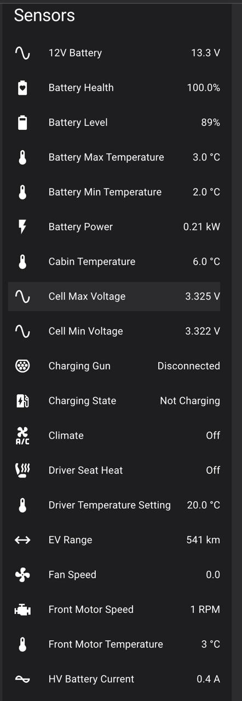
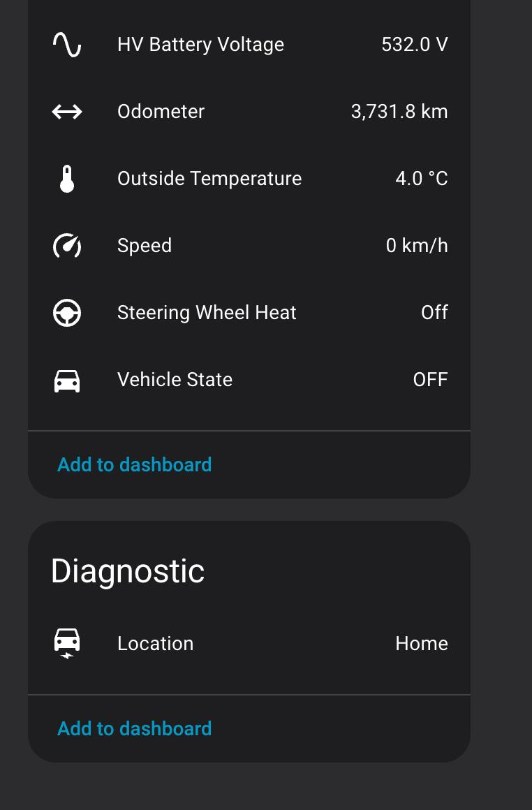

# Інтеграція з Home Assistant

BYD EV Pro може передавати телеметрію автомобіля в реальному часі до Home Assistant через webhook. Надається HACS-компонент, який автоматично створює сенсорні сутності та GPS-трекер пристрою.

> [!NOTE]
> Інтеграція з Home Assistant доступна лише у **розширеній версії** (потрібна активна підписка або пробний період).

---

## Загальні відомості

| | |
|---|---|
| Тип інтеграції | Webhook (cloud_push) |
| Напрямок даних | Автомобіль → Home Assistant (одностороння передача) |
| HACS-компонент | `byd_ev_pro` |
| Платформи | Sensor, Device Tracker |
| Сенсори | 26 |

Автомобіль передає дані сенсорів до вашого екземпляра Home Assistant з регулярним інтервалом. Опитування з боку HA не потрібне — інтеграція пасивно отримує дані через webhook.

---

## Встановлення

### HACS (рекомендовано)

1. Відкрийте HACS у вашому екземплярі Home Assistant.
2. Перейдіть до **Інтеграції > Користувацькі репозиторії (Custom Repositories)**.
3. Додайте URL репозиторію: `https://github.com/ant0nkr/ev-pro-ha-integration` (категорія: Integration).
4. Знайдіть **BYD EV Pro** та встановіть.
5. Перезапустіть Home Assistant.

### Вручну

1. Завантажте директорію `custom_components/byd_ev_pro/` з `https://github.com/ant0nkr/ev-pro-ha-integration`.
2. Скопіюйте її до папки `config/custom_components/` вашого Home Assistant.
3. Перезапустіть Home Assistant.

---

## Налаштування

1. У Home Assistant перейдіть до **Налаштування > Пристрої та сервіси > Додати інтеграцію**.
2. Знайдіть **BYD EV Pro**.
3. Введіть назву вашого автомобіля (наприклад, «Song Plus EV»).
4. Інтеграція покаже **URL webhook** — скопіюйте його.
5. У застосунку BYD EV Pro на автомобілі перейдіть до **Налаштування > Home Assistant** та вставте URL webhook.

Автомобіль почне передавати дані до Home Assistant.

---

## Опції

Після налаштування перейдіть до опцій інтеграції для конфігурації:

| Опція | Опис |
|---|---|
| Довгостроковий токен доступу (Long-lived access token) | Токен доступу HA для автентифікованих webhook-викликів |
| Секрет webhook (Webhook secret) | Ключ HMAC-підпису для перевірки payload webhook |
| Голосові дії (Voice actions) | Прив'язка скриптів HA до голосових команд в автомобілі (див. нижче) |

---

## Скріншоти

### Сенсорні сутності

Усі 25 сенсорів, відображених у Home Assistant з даними автомобіля в реальному часі.

### Трекер пристрою

GPS-відстеження з відображенням автомобіля на карті.

---

## Сенсори

Інтеграція створює 26 сенсорних сутностей:

### Батарея

| Сенсор | Одиниця | Опис |
|---|---|---|
| Battery Level | % | Поточний рівень заряду (SOC) |
| Battery Health | % | Стан здоров'я батареї (SoH) |
| HV Battery Voltage | V | Напруга високовольтної батареї |
| HV Battery Current | A | Струм батареї (позитивний = розряд, негативний = заряд) |
| Battery Power | кВт | Миттєва потужність батареї |
| 12V Battery | V | Напруга допоміжної 12В батареї |
| Cell Max Voltage | V | Найвища напруга окремої комірки |
| Cell Min Voltage | V | Найнижча напруга окремої комірки |

### Температура

| Сенсор | Одиниця | Опис |
|---|---|---|
| Cabin Temperature | °C | Температура в салоні |
| Outside Temperature | °C | Зовнішня температура |
| Battery Max Temperature | °C | Найвища температура модуля батареї |
| Battery Min Temperature | °C | Найнижча температура модуля батареї |
| Front Motor Temperature | °C | Температура переднього електромотора |
| Rear Motor Temperature | °C | Температура заднього електромотора |

### Рух

| Сенсор | Одиниця | Опис |
|---|---|---|
| EV Range | км | Оціночний залишковий запас ходу |
| Odometer | км | Загальний пробіг (монотонно зростаючий) |
| Speed | км/год | Поточна швидкість автомобіля |
| Vehicle State | — | OFF / ACC / READY |
| Front Motor Speed | об/хв | Швидкість обертання переднього мотора |

### Заряджання

| Сенсор | Одиниця | Опис |
|---|---|---|
| Charging State | — | Not Charging / Charging / Charge Complete |
| Charging Gun | — | Disconnected / AC / DC |

### Клімат

| Сенсор | Одиниця | Опис |
|---|---|---|
| Climate | — | Off / On |
| Driver Temperature Setting | °C | Цільова температура зони водія |
| Fan Speed | — | Поточний рівень швидкості вентилятора |
| Steering Wheel Heat | — | Off / On |
| Driver Seat Heat | — | Off / Level 1 / Level 2 |

---

## Трекер пристрою (GPS)

Інтеграція створює сутність GPS-трекера (`device_tracker.{vehicle_name}_location`) з:

- Широтою та довготою
- Напрямком та висотою (коли доступні)
- Рівнем заряду батареї, що відображається на картці карти

Місцезнаходження оновлюється разом з даними сенсорів, коли автомобіль має GPS-фіксацію.

---

## Голосові дії

Ви можете прив'язати скрипти Home Assistant до голосових команд в автомобілі. Це дозволяє, наприклад, сказати «відкрий ворота» і запустити скрипт HA.

Щоб додати голосову дію:

1. Перейдіть до опцій інтеграції в HA.
2. Оберіть **Додати голосову дію (Add voice action)**.
3. Виберіть скрипт зі списку.
4. Задайте голосові фрази українською та/або англійською.
5. За бажанням задайте фрази підтвердження, які автомобіль промовить у відповідь.

Автомобіль отримує ці дії через відповідь webhook і додає їх до голосового асистента.

---

## Дивіться також

- [Налаштування](10-settings.md)
- [Голосовий помічник](08-voice-assistant.md)
- [Telegram](14-telegram.md)
